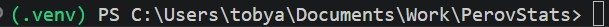

# PerovStats usage instructions

This page assumes you have downloaded and set up PerovStats. If not, please follow the instructions found in [installation.md](installation.md).

## Running from the notebook

### perovstats-demo.ipynb

#### This is the demo notebook for an explanation on running PerovStats and the processes it goes through. Use this notebook first to see how files will be processed. As this is for example purposes, only one file can be inputted per run.

- In the second code block there are paths for you to edit:
    - `img_file`

        The input filepath. Two files are provided for you to test, simply remove the `# ` from one and add it to the start of the other to switch files.
    - `output_dir`

        The directory to save the results and output to. If the folder does not exist this will be created while running PerovStats.
    - `config_path`

        The configuration file (`.yaml`) to be used in the program's run. For the demo notebook this can be left as is and default configuration options will be used.

        (For help creating a custom config file refer to the [config documentation](config.md))

- You can now start running the cells (one at a time or all at once). Images will appear through the notebook as cells run showing you the latest stage of the process. The segmentation cell may take a few minutes to complete, if no error message shows assume everything is running as expected.

- Images of the scan, graphs, `.csv` files and a copy of the configuration options used will be saved to the output directory you chose earlier.

### perovstats-process.ipynb

#### This is the main notebook to use when running PerovStats, and allows multiple files to be processed in one run

## Running from the command line

### Preparing the environment

- In your command prompt/ terminal, navigate to the main PerovStats folder (the folder with subfolders such as `/docs/` and `/src/` in it)

- Ensure you have started you virtual environment. If you do not see `(venv)` on the left of the command lines type:

    - **Windows:** `venv\Scripts\activate`
    - **macOS/Linux:** `source venv/bin/activate`

    `(venv)` should now appear and you are ready to run PerovStats

### Running the program with default settings

- The program can be run with the command `perovstats`. This will use the default settings and take config options from `default_config.yaml` found in `/src/perovstats/default_config.yaml`. Please do not move this file.

### Running the program with custom settings

- If you would like custom config settings:

    - Copy the contents of `default_config.yaml` into a new file in a destination of your choosing, and name it something like `config.yaml`.

    - The settings and options within this file can now be changed to suit your needs.

    - When starting the program, add `--config "config.yaml"` (or whatever you named the config file) to the end of the command, for example:

        `perovstats --config "config.yaml"`
